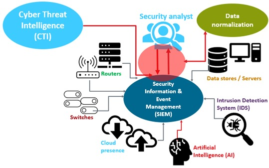

# Cybersecurity Roadmap

## **Before start you should know:**

---

<aside>
📌 Cybersecurity has an extensive number of fields , so you should state your position in it.

</aside>

**The next few videos will help you to chose your field,know about them and follow you passion**

1. **Source 1 : [So you wanna do security?](https://youtu.be/i8rizLc4hc0) (Muhammad Gamal’s Video)**
2. **Source 2 : Nakerah Network’’s [Playlist](https://youtube.com/playlist?list=PL_yseowcuqYI9cE8Qonbr0SGN1XQFEEPg)**

---

---

**▶ What are our Sub-Circles in CAT Reloaded?**

1. **Penetration testing**
    - **Web Pentesting**
    - **Network Pentesting**
2. **Reverse Engineering & Malware Analysis**
3. **Network Security**
4. **SOC(Security Operation Center)**

---

<aside>
📌 Take your time while deciding which field to study While doing That we will get into The ENTRY Level so we don't waste time

</aside>

---

# **In the Entry level You should:**

## **Take an overview in:**

### **📌 1. Networking**

**The content is The first Chapter of CCNA some topics are useless in our case**

| Module | Topic | To do |
| --- | --- | --- |
| 1 | Networking Today | Read Only |
| 2 | IOS Navigation | Nothing |
| 3 | Protocols and Models | Study |
| 4 | Physical Layer | Nothing |
| 5 | Number Systems | Nothing |
| 6 | Data Link Layer | Study |
| 7 | Ethernet Switching | Study |
| 8 | Network Layer Characteristics | Study |
| 9 | Address Resolution | Study |
| 10 | Configure Initial Router Settings | Nothing |
| 11 | IPv4 Addressing | Study |
| 12 | IPv6 Addressing | Nothing |
| 13 | ICMP | Study |
| 14 | Transportation of Data | Study |
| 15 | Application Layer | Study |
| 16 | Network Security Fundamentals | Study |
| 17 | Build a Small Network | Nothing |
| Chapter 2 - Module 3 | Network Security Concepts | Important|

### Videos:

- Watch This playlist From 22 -> 29 : [Networking Basics](https://www.youtube.com/playlist?list=PLtr9ezc61PUbA2l3MiE4YbrgITJN84N-C)
- Watch Amr Talaat Videos : [Video 1](https://www.youtube.com/watch?v=LDp5-y9APlw&list=PLDyW0GpJbH0tD4dhtqU2C4TNC6bSZgYtT&index=2) [Video 2](https://www.youtube.com/watch?v=q11YmOTtu-s&list=PLDyW0GpJbH0tD4dhtqU2C4TNC6bSZgYtT&index=3)

Additional Resource : [Powercert Animated Videos](https://www.youtube.com/c/PowerCertAnimatedVideos)

### **📌 2.LINUX**

[**why to use Linux ?**](https://blog.catreloaded.org/2020/09/why-to-use-linux/)

### **Book : Linux Basics For Hackers**

| Chapter | To Do |
| --- | --- |
| 1 | Study |
| 2 | Study |
| 3 | Study |
| 4 | Study |
| 5 | Study |
| 6 | Study |
| 7 | Study |
| 8 | Study |
| 9 | Study |
| 10 | Study |
| 11 | Nothing |
| 12 | Study |
| 13 | Study |
| 14 | Study |
| 15 | Nothing |
| 16 | Study |
| 17 | Nothing |

### **Videos :**

- [**Arabic Linux Course**](https://youtube.com/playlist?list=PLAZ__zcDB1IaNaVNOckNpgEpjghSHr8Gg)
- [Hassan Saad Cource](https://www.youtube.com/playlist?app=desktop&list=PLtr9ezc61PUbA2l3MiE4YbrgITJN84N-C)  : Watch The First 13 Video

## **To do :**

**Solve the following rooms or [Try Hack Me](https://tryhackme.com):**

[Room 1](https://tryhackme.com/room/linuxfundamentalspart1) [Room 2](https://tryhackme.com/room/linuxfundamentalspart2) [Room 3](https://tryhackme.com/room/linuxfundamentalspart3) [Room 4](https://tryhackme.com/room/linuxstrengthtraining) [Room 5](https://tryhackme.com/room/ninjaskills)

<aside>
📌 That’s not enough, Being good with Linux = Using Linux

</aside>

# **Notes for this phase:**

**🔴 1. there are seminars with the leaders of the Sub-Circles to talk about their Fields and what they do in more details.**

**🔴 2. At the end of this level, a member can decide if he choose the right sub-circle for him or not.**

---

---

# You have been waiting for this, **Pick Your Path and move:**

---

## **1️⃣ Reverse Engineering & Malware Analysis Path (REMAR)**

- **Here’s our [new roadmap](https://drive.google.com/file/d/13nDt8I-LoUq350HgeVq0UVhoF9qyhQVh/view?usp=sharing), We will make sure to keep it updated.**

---
---

## **2️⃣ Penetration Testing Path**

### **Web App Penetration testing Path (WAPTR)**

**📌 1. Our old Roadmap [HERE](https://drive.google.com/file/d/1YlYBgkith2ycK8aqP2bv_a-S9YD6LANi/view?usp=sharing) By Muhammad Gamal**

**Here’s The [new one](https://www.notion.so/Penetration-Testing-Roadmap-89fd7b2f644d4324ad791d1cc2d3c40c) base on the old roadmap and more simplified(We will make sure to keep it updated)**

📌 2. To Practice:
- Create account on [hackerone](https://www.hackerone.com/) , [bugcrowd](https://www.bugcrowd.com/), [intigriti](https://www.intigriti.com/programs)
- You should practice very well so you should Download [OWASP Broken Web Application project](https://sourceforge.net/projects/owaspbwa/) Try to install it on VMware or VirtualBox from [Here](https://www.youtube.com/watch?v=p7uqu4o3RhY&t=507s)
- preferable to download this first and practice very well i love:

**1️⃣[bwapp](http://www.itsecgames.com/)**

**2️⃣[Dvwa](https://tryhackme.com/room/dvwa)**

**3️⃣[portswigger labs](https://portswigger.net/web-security)**

**4️⃣ [Hack The Box](https://www.hackthebox.eu/)**

**5️⃣[OWASP Juicy](https://tryhackme.com/room/owaspjuiceshop)**

**6️⃣[TryHackMe](https://tryhackme.com/)**

- **If you are stuck in a lab solution, try searching on [Google](http://google.com/)**
- **Plan Time-Line Soon**

**optional to make it easy to study**

---

### **Network Penetration testing Path (NPTR)**

**📌 1. Our New Roadmap [HERE](https://drive.google.com/file/d/1OGCm2PHs0qX1NqmkeZFv9q-lo10fPbht/view?usp=sharing) includes many steps from Zero to HeroBTW you will need to practice more.**

**📌 2. There are many option Courses each course include content may conflict with other courses but there are courses to be unique.**

**📌 3. We will Practice on Machines [HTB](https://www.hackthebox.eu/) , [tryHackMe](https://tryhackme.com/) , [Vulnhub Walkthrough](https://github.com/Ignitetechnologies/Vulnhub-CTF-Writeups)**

**optional to make it easy to study**

---
---

## **3️⃣ Network Security Path (defensive)**

**📌 Here is our new [Network Security Roadmap](https://miro.com/app/board/uXjVPE4oYWY=/?share_link_id=195978630549)**

---
---

## **4️⃣ SOC(Security Operation Center) PATH**

### Practical Path 
**📌 You can go through this path if you like the practical stuff like try hack me and Cyber Defenders... [Here's our SOC Practical Path](https://0xmedhat.gitbook.io/whoami/soc-roadmap-rooms-and-challanges-zero-2-hero)**

### Courses Path 
**📌 You can go through this path if you like the books and courses... [Here's our SOC Courses Path](https://docs.google.com/spreadsheets/d/1X8tynxB1-54ABqsEJyChbIhBARsD5hz2B52clvqZ_y0/edit#gid=0)**

---
---

## **5️⃣ DFIR PATH**

- **Here’s our DFIR  [roadmap](https://docs.google.com/document/d/1sDvtOnocz3zTT2VBDixJz3rSFbW8PAdGh8TDQ-q3SNc/edit).**
